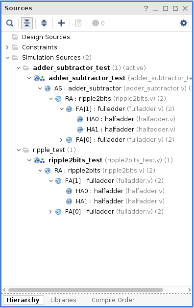

# Assignment for Lab 05 Verilog Into

This assignment is preparing you for future submission. Most of the code for both problems are already written in class, the part that has not written yet should be
very straight forward. You must make sure your submission satisfy all the requirement in order to get full credit.

## Submission
This lab will be submitted using git commands we have learned in lab01. In order for git to track your files, and for me to grade your submission, youusing the following structure to store you project and source files:

- **src**: All verilog files must be placed in this folder
- **sim**: All simulation files, i.e. .wcfg files must be placed in this folder
- Project must be named as "Lab05", and the project configuration file, Lab05.xpr should be stored in assignment's directory. You can verify this by opening your assignment repository's folder, and the Lab05.xpr should be listed directly in that folder instead of any sub-folders.

So when I'm grading your assignment, I will clone your assignment to my machine, and open your project by open the xpr file from Vivado. All your project's simulation set and source files must be loaded.

Your simulation sets should look something like this before you submit:

## Grading:
- For each problem, you **must** have a seperate simulation set in the same project. Each simulation set's name will be specified in the problem description. You should name your simulation set **exactly** the way it was specified in the problem. Otherwise, you will lose points for it.

**Clarification**: If in the problem it specified the name of the simulation set to be "abc", you should name your simulation set as "abc" **exactly**. It should not be "Abc" or "ABC" or "a\_b\_c" or anyother way.
<!-- - If you have a simulation set for the problem, but no test bench for the module you are asked to implement, you will lose half of the points even if you implemented it correctly. -->
- All source files (.v files) **must** be stored in src folder
- All waveform configuation (.wcfg files, when you save the simulation setting) files **must** be stored in sim folder

## Problems

### 1. Implement and test a two bits ripple adder (5 pts)
- Name the simulation set as "ripple_test"
- Name the ripple adder module as "ripple_adder"
- Implmenent the ripple adder using the full adder module we have built in the lab
- Write a test module to verify the correctness of your ripple adder
- Save your timing diagram. So when I load your project and run this simulation, the saved timing diagram should show up, not the "untitle 1".

### 2. Implement and test a two bits adder subtractor (5 pts)
- Name the simulation set as "adder\_subtractor\_test"
- Name the adder subtractor module as "adder_subtractor"
- Implement the adder subtractor using the ripple adder from problem 1.
- Write a test module to verify the correctness of your adder subtractor.
- Save your timing diagram.

